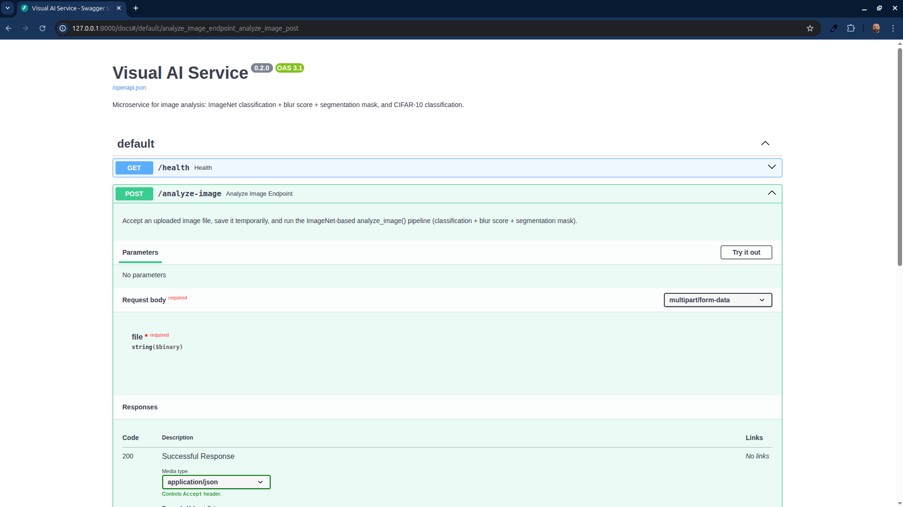

<p align="center">
  
</p>

# Visual AI Microservice

------------------------------------------------------------------------

**Visual AI Service** is a production-ready microservice built with  
**Python, FastAPI, PyTorch, and computer-vision tooling**.

It performs classification, blur detection, and optional segmentation on images and exposes:
- A modern **FastAPI interface**  
- A clean REST API  
- A CLI client  
- A training workflow for CIFAR-10  
- Outputs compatible with **GIMP / Inkscape / Blender / Unity**

------------------------------------------------------------------------

## Core Features

# Visual AI Microservice — Progress Report

## ✅ Completed Chapters (in order)

### Chapter 1: Project Definition & Structure
- Input/output specification defined.
- Repository structure created.
- Standards for readability and naming applied across the codebase.

### Chapter 2: Environment & Tooling Setup
- Python virtual environment configured.
- Dependencies installed (FastAPI, Torch, TorchVision, OpenCV, Pillow).
- PyCharm project initialized.

### Chapter 3: Data Preparation (CIFAR-10)
- Automatic CIFAR-10 download.
- Data augmentation pipeline implemented.
- Training/validation dataloaders created.

### Chapter 4: Model Training (PyTorch)
- ResNet18 chosen as backbone.
- CIFAR-10 fine-tuning pipeline implemented.
- Model checkpoints and class-name files generated.
- Best model saved to `artifacts/models/`.

### Chapter 5: Inference Pipeline
- Unified inference module (`analyzer.py`) created.
- Supports both:
  - **ImageNet classification** (pretrained)
  - **CIFAR-10 classification** (fine-tuned)
- Blur detection via Laplacian variance.
- Optional foreground segmentation via DeepLabV3.

### Chapter 6: FastAPI Service
- `/health` endpoint for health checks.
- `/analyze-image` (ImageNet + blur + segmentation).
- `/analyze-image-cifar` (CIFAR-10 + blur).
- Pydantic schemas for structured responses.

### Chapter 7: CLI Demo Client
- `client.py` lets you call the API from terminal.
- Outputs JSON and formatted summary.
- Supports both processing modes: `imagenet` / `cifar`.

### Chapter 8: External Tool Integration
- Generated segmentation masks load correctly in:
  - GIMP
  - Inkscape
  - Blender
  - Unity

### Chapter 9: Documentation & Code Quality
- Full code refactoring for clarity.
- Descriptive functions, variables, and docstrings.
- Clean, readable codebase ready for interviews.
- Professional README styling applied.

------------------------------------------------------------------------

## Tech Stack

- Python 3.12+
- FastAPI
- Uvicorn
- PyTorch
- TorchVision
- OpenCV
- Pillow
- NumPy
- Requests (CLI client)

------------------------------------------------------------------------

## Installation

### Clone & Setup

```bash
git clone https://github.com/damir-bubanovic/VisualAIServices.git
cd VisualAIServices

python3 -m venv .venv
source .venv/bin/activate

pip install -r requirements.txt
```

------------------------------------------------------------------------

## Running the Service

### Start the API

```bash
uvicorn src.api.main:app --reload
```

The service will be available at:

```
http://127.0.0.1:8000
```

Interactive documentation (Swagger UI):

```
http://127.0.0.1:8000/docs
```

------------------------------------------------------------------------

## Using the CLI Client

### ImageNet pipeline

```bash
python client.py --image images/cat.jpeg --mode imagenet
```

### CIFAR-10 pipeline

```bash
python client.py --image images/cat.jpeg --mode cifar
```

------------------------------------------------------------------------

## Training the CIFAR-10 Model

```bash
python -m src.training.train
```

This generates:

- `artifacts/models/resnet18_cifar10.pth`  
- `artifacts/models/cifar10_classes.txt`  

------------------------------------------------------------------------

## Endpoints

### `GET /health`
Returns service status.

### `POST /analyze-image`
- ImageNet classification  
- Blur detection  
- Segmentation mask  

### `POST /analyze-image-cifar`
- CIFAR-10 classification  
- Blur detection  

------------------------------------------------------------------------

## Project Structure

```
src/
 ├── api/
 │    └── main.py
 ├── inference/
 │    └── analyzer.py
 ├── models/
 │    └── model_loader.py
 ├── training/
 │    └── train.py
 └── utils/
      └── image_utils.py

client.py
requirements.txt
```

------------------------------------------------------------------------

## Deployment

Production server example:

```bash
uvicorn src.api.main:app --host 0.0.0.0 --port 80
```

Suggested optimizations:

- Use `uvicorn` or `gunicorn` workers.
- Enable model warm-up at startup.
- Serve behind Nginx or Traefik.

------------------------------------------------------------------------

## Creator

**Damir Bubanović**

- https://damirbubanovic.com  
- GitHub: https://github.com/damir-bubanovic  
- YouTube: https://www.youtube.com/@damirbubanovic6608  

------------------------------------------------------------------------
